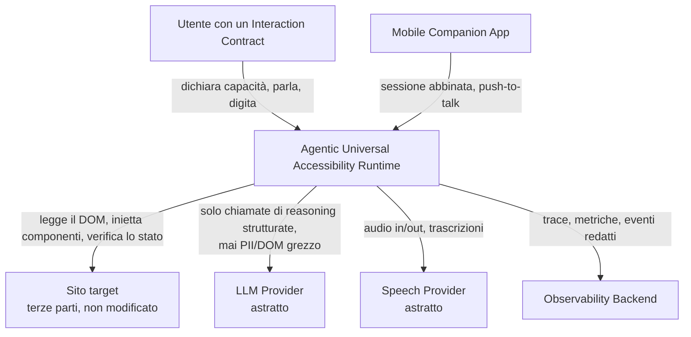
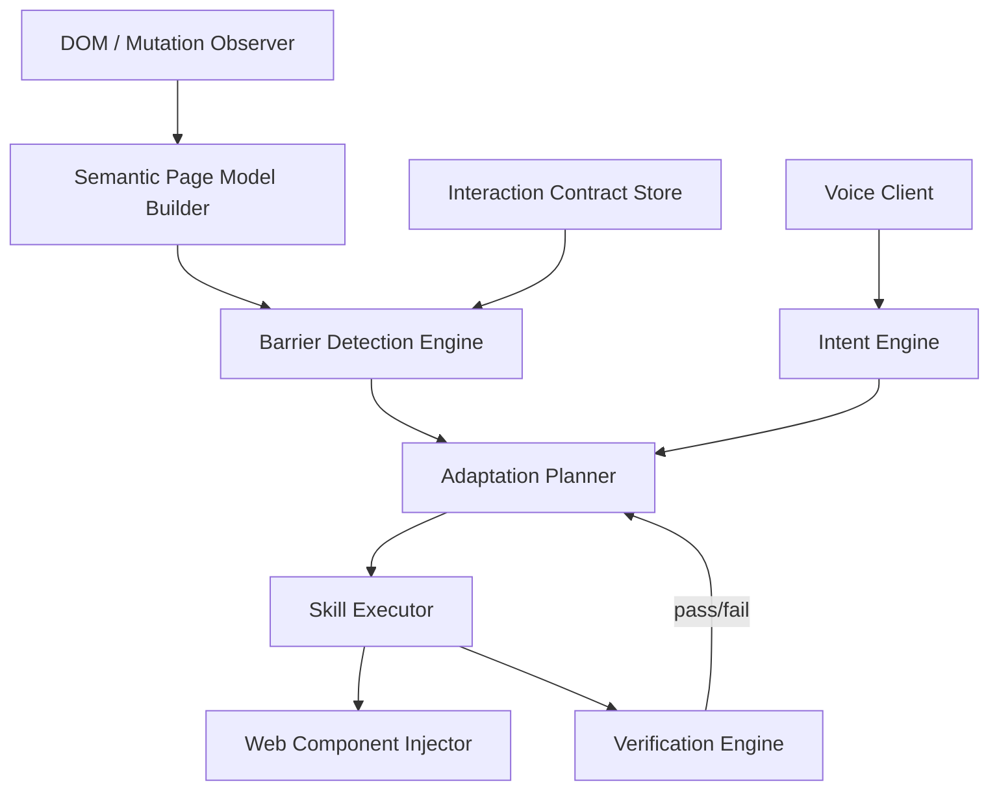

# AUA
## Agentic Universal Accessibility Runtime

Rendere accessibile qualsiasi sito web, senza toccarne il codice sorgente.

*Status: ACCEPTED (baseline) — Owner: Principal Architect*

---

## Il problema

La maggior parte dei fallimenti di accessibilità **non è** "l'utente non vede la pagina".

È un **mismatch di modalità**:
> un controllo richiede un'interazione (drag, hover, puntamento preciso) che l'utente non è in grado di eseguire.

- Il sito è di terze parti, non modificabile
- Il problema si manifesta **in tempo reale**, sessione per sessione
- Non si può aspettare che il proprietario del sito lo corregga

---

## La soluzione, in una frase

Un runtime **browser-resident** che osserva la pagina, individua i **Barrier**
tra ciò che la pagina richiede e ciò che l'utente dichiara di poter fare,
e li risolve invocando **Skill predefinite e verificate** — mai codice generato al volo.

---

## I 5 componenti

1. **Browser Extension** (Manifest V3) — osserva la pagina, inietta adattatori accessibili
2. **Universal Accessibility Bootstrap** — l'utente dichiara capacità/preferenze (`InteractionContract`), deterministico, **indipendente dall'LLM**
3. **Agentic Accessibility Runtime** — costruisce il `SemanticPageModel`, rileva i `Barrier`, li risolve tramite lo **Skill Registry** (set chiuso, versionato)
4. **Mobile Companion App** — telecomando abbinato: push-to-talk, STT/TTS, conferma comandi
5. **Voice subsystem** — astratto dietro `SpeechProvider`: speech-to-speech realtime + fallback STT→Agent→TTS

---

## System Context



Vincolo chiave: **AUA non invia mai contenuto grezzo del sito target a un LLM o a un provider vocale senza passare dalle regole di redazione (ADR-015 — Privacy).**

---

## Come funziona: il ciclo di un Barrier



L'LLM **sceglie** una Skill da un registro chiuso — non genera mai DOM/JS al volo.
Ogni esecuzione è seguita da una **verifica** obbligatoria dello stato risultante.

---

## Scelte architetturali principali

| # | Decisione | Scelta | Confidenza |
|---|---|---|---|
| 1 | Topologia runtime | Shell deterministica, decisioni agentiche (core nel browser, control plane sottile nel backend) | Alta |
| 2 | Rappresentazione semantica | `SemanticPageModel` ibrido grafo/albero, mai DOM grezzo all'LLM | Alta |
| 3 | Orchestrazione | Nessun framework pesante nel browser; orchestratore custom sottile. **LangGraph solo nel backend** per workflow stateful (pairing mobile, pipeline di valutazione) | Media |
| 4 | Voce | `SpeechProvider` agnostico dal vendor; default speech-to-speech realtime, fallback STT→intent→TTS | Media |
| 5 | Esecuzione adattamenti | Skill Registry chiuso; l'LLM seleziona, non genera codice | Alta |
| 6 | Repository | Monorepo, boundary di package rigidi, contratti congelati | Alta |

---

## Cosa NON fa (deliberatamente)

- ❌ Non diagnostica la disabilità — ragiona solo su un `InteractionContract` auto-dichiarato ed editabile
- ❌ Non certifica la conformità WCAG del sito target — certifica che una *specifica barriera bloccante* è stata *risolta e verificata* per una sessione
- ❌ Non esegue JavaScript generato liberamente dall'LLM — tutto passa dallo **Skill Registry** versionato
- ❌ Non si lega a un singolo vendor LLM o vocale — entrambi dietro interfacce astratte
- ❌ Non garantisce l'adattamento di ogni interazione possibile — il "nessun adattamento" è un esito esplicito, mai un fallimento silenzioso

---

## Rischi principali

| Rischio | Probabilità | Impatto | Mitigazione |
|---|---|---|---|
| Parità API accessibility-tree tra browser | Alta | Media | Fallback DOM/ARIA ovunque; API browser solo come enhancement |
| Tecniche di scrittura form si rompono al cambio versione dei framework | Media | Alta | Verifica obbligatoria, mai fidarsi ciecamente del successo di una scrittura |
| Vendor voce realtime senza garanzie di data-residency EU | Media | Alta | Fallback a pipeline concatenata **obbligatorio**, non opzionale |
| Piano dell'agente referenzia una Skill non registrata/obsoleta | Bassa | Alta | Rifiuto hard nello Skill Executor, indipendente dal Planner |
| Bypass della redazione (dati sensibili raggiungono LLM/telemetria) | Bassa | Critico | Doppio punto di enforcement indipendente + test avversariali |

---

## Percorso critico

```
WP-001 Contracts → WP-007 Semantic Page Model → WP-012 Barrier Detection
   → WP-014 Adaptation Planner → WP-018 Verification Engine → WP-020 Prima slice verticale
```

**Prima ondata parallela (PG-0)**, nessuna dipendenza condivisa:
Contracts · Extension Skeleton · Web Component SDK · Voice Benchmark (spike) · Skill SDK (registry) · Observability

---

## Domande aperte (bloccanti)

1. Vendor voce di default — in attesa dei risultati del benchmark (WP-004)
2. Finestre di retention degli audit record — in attesa di review legale/DPO
3. Parità API accessibility-tree cross-browser — in attesa di spike di verifica
4. Requisiti di durabilità del checkpoint store di LangGraph — in attesa del sizing di Fase 2

---

# Grazie

**AUA** — risolvere il mismatch di modalità, non indovinare la disabilità.

Riferimenti: `docs/architecture/`, `docs/adr/ADR-001…020`, `docs/contracts/`, `docs/work-packages/`
