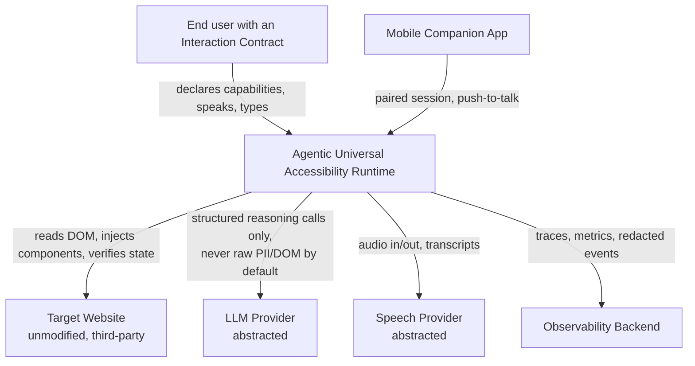
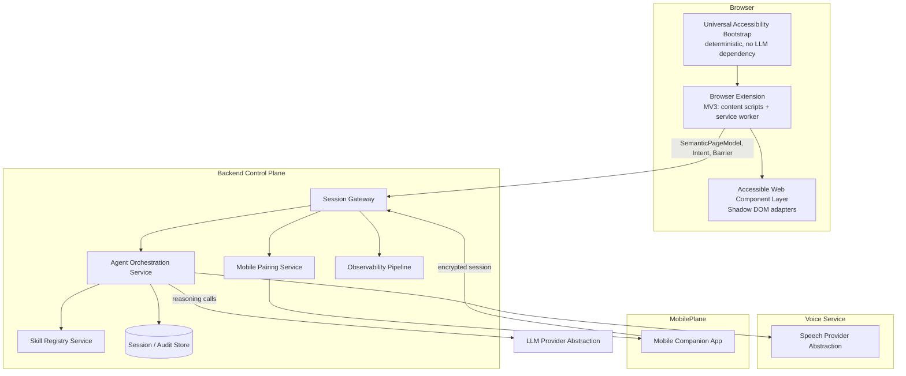
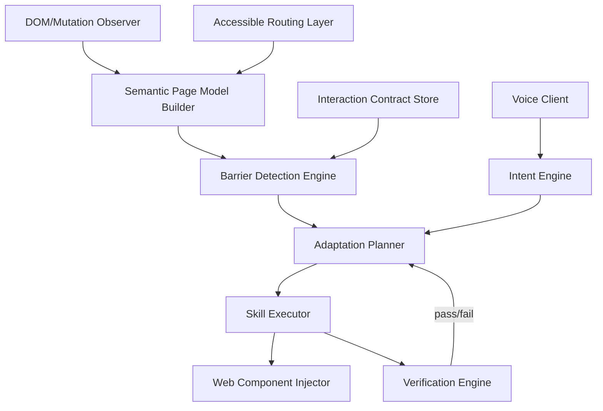

# 01 — System Context & Container Architecture (C4)

## System Context

Key context boundary: **AUA never sends the target site raw content to an LLM or speech
provider without going through redaction rules defined in ADR-015 (Privacy).**

## Container View

### Container responsibilities

| Container | Responsibility | Must remain functional even if... |
|---|---|---|
| Universal Accessibility Bootstrap | Create/edit `InteractionContract`, expose recovery UI | LLM, backend, voice are all down |
| Browser Extension (runtime core) | DOM observation, `SemanticPageModel` build, skill execution, verification | Backend is unreachable (degrade to local rules only) |
| Accessible Web Component Layer | Render accessible adapters (proxy pattern) | Target site re-renders/SPA-navigates |
| Session Gateway | AuthN of extension/mobile sessions, request routing | — (single point; see ADR-020 for HA) |
| Agent Orchestration Service | Barrier→Adaptation reasoning, skill selection | LLM provider fails over per ADR-006 |
| Skill Registry Service | Source of truth for skill definitions/versions | — |
| Mobile Pairing Service | QR/token pairing, encrypted channel | Mobile app simply unavailable, browser still works |
| Speech Provider Abstraction | Uniform STT/TTS/realtime interface | Falls back per ADR-007 degraded mode |
| Observability Pipeline | Traces/metrics/redacted events | Failure must never block user-facing action |

## Component View (Browser Extension, expanded)

This component graph is the basis for package boundaries in `08-repository design` and for the
parallelization DAG.
